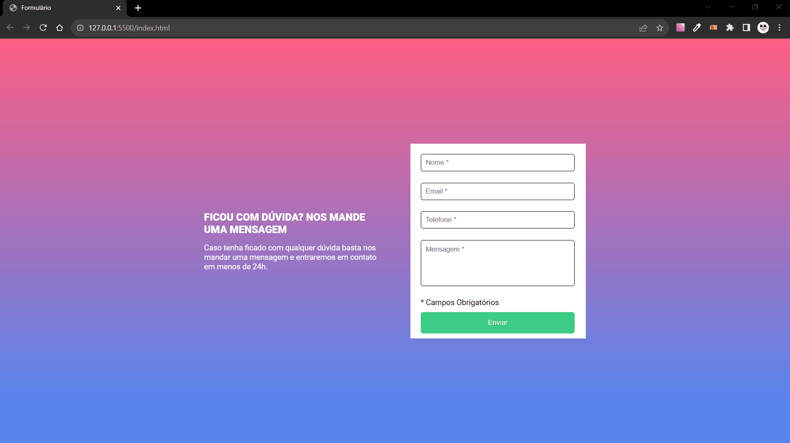

## 🚀 Quest com HTML, CSS e JavaScript 🚀
 
 Essa é uma quest do curso [DevQuest - DevEmDobro](https://www.linkedin.com/school/devquest-dev-em-dobro/) para os seus alunos treinarem JavaScript.

 ## Objetivo

    Essa quest tem como objetivo melhorar as habilidades em HTML5, CSS3 e JavaScript através da realização de projetos 

##  Quest JavaScript intermediário 

[Meu codigo](https://github.com/Willy-Braga/form-validation)

[Post LinkedIn]() 

##### O que eu aprendi

* *Aprendi a criar uma pequena função em JS para informar que só se pode realizar o envio após o preenchimento do Formulário*
* *[Funções JavaScript](https://www.w3schools.com/js/js_functions.asp)*
* *[Eventos JavaScript](https://www.w3schools.com/js/js_events.asp)*

